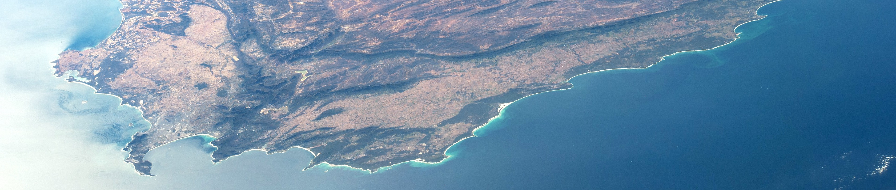

### Hello / Howzit / Molo 👋

My name is Glenn Moncrieff and I am a *Data Scientist* and *AI Engineer* based in Cape Town, South Africa.

My background is in geography and ecology, and nowadays I spend most of my time trying to improve conservation outcomes using all the tool savailable to a modern data scientist

I observed the earth with satellites 
I monitor species with in situ sensors
I assemble and understand patterns in large datasets using AI
I forecasts the future for global biodiversity

I am most comfortable coding in Python and R.

My research has looked at a range of environmental	issues like [mapping plant biomes](https://onlinelibrary.wiley.com/doi/abs/10.1111/gcb.13367), [modelling water loss to invasive plants](https://onlinelibrary.wiley.com/doi/abs/10.1002/hyp.14161), [rapidly detecting habitat loss in shrublands ](https://www.mdpi.com/2072-4292/14/12/2766) or [forecasting post-fire vegetation recovery](https://www.sciencedirect.com/science/article/pii/S092427162030143X). I also wrote about climate change impacts on African ecosystems in the Africa chapter of the latest [IPCC report](https://www.ipcc.ch/report/ar6/wg2/).

I like to see science turned into real-world applications and software that the community can use. So I spend lots of time turning research into packages or operational products. Some fun software that I have created or contributed to:

- [Global Renosterveld Watch](https://github.com/mgietzmann/global_renosterveld_watch): Deploys trained tensorflow models to GCP via Apache Beam to predict shrubland habitat loss.

- [hyper-iap](https://github.com/GMoncrieff/hyper-iap): Mapping alien invasive plants from hyperspectral imagery using deep learning.
  
- [saeonobspy](https://github.com/GMoncrieff/saeonobspy): An Python package to query and downloaded environmental data from the SAEON observations database

- [Ecological Monitoring and Management Application](https://github.com/AdamWilsonLab/emma_envdata): An environmental data processing pipeline for forecasting satellite observed postfire vegetation recovery

- [SciArgus](https://github.com/GMoncrieff/SciArgus)): Weekly scientifc literature AI search and summary

Want to connect?

- 💻 Get in touch to chat about projects with a geospatial, earth observation or biodiversity focus: <glennmoncrieff@gmail.com>

- 📫 Follow me on my [website](https://gmoncrieff.github.io/)

